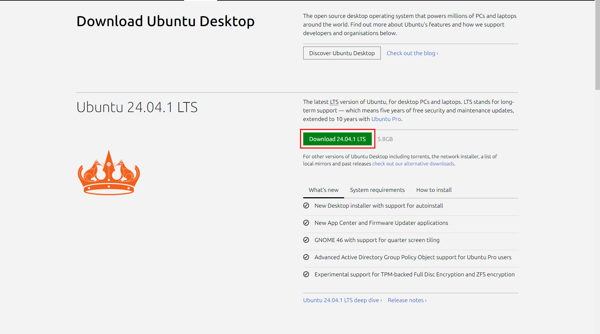
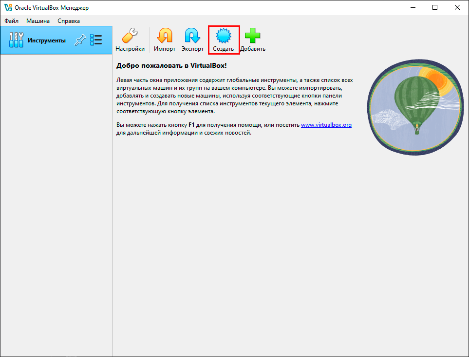
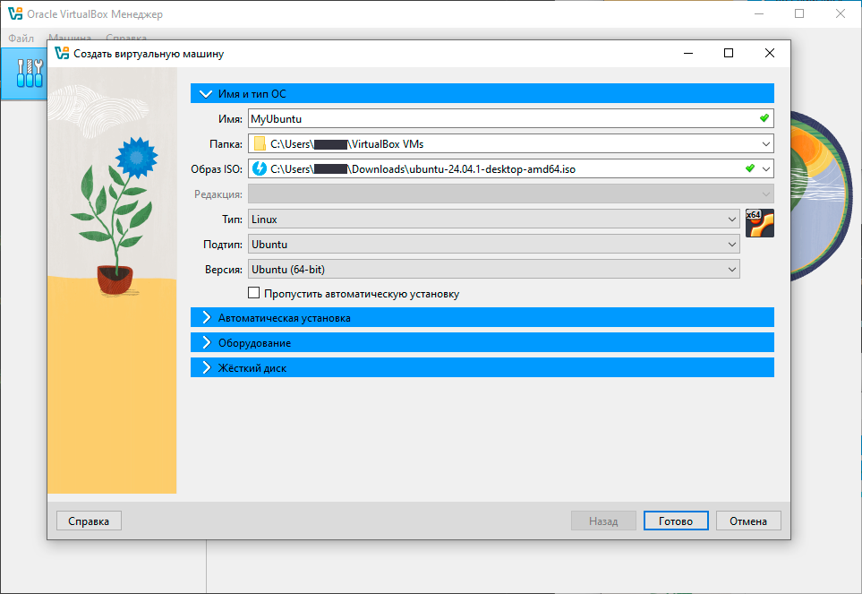
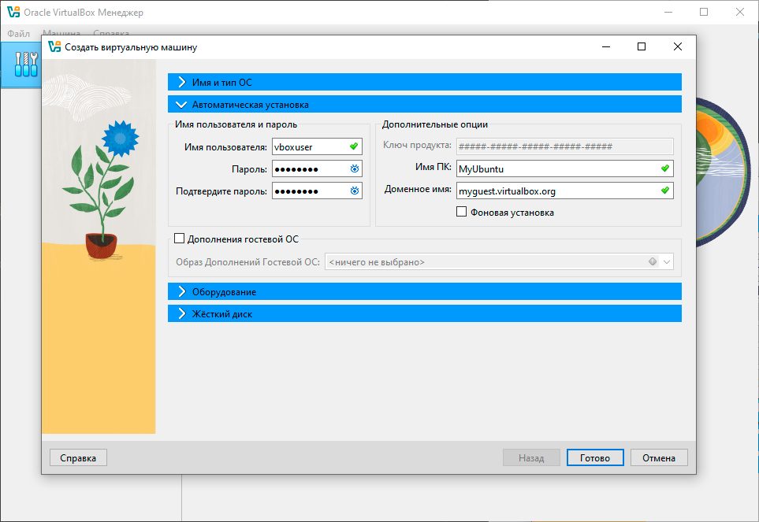
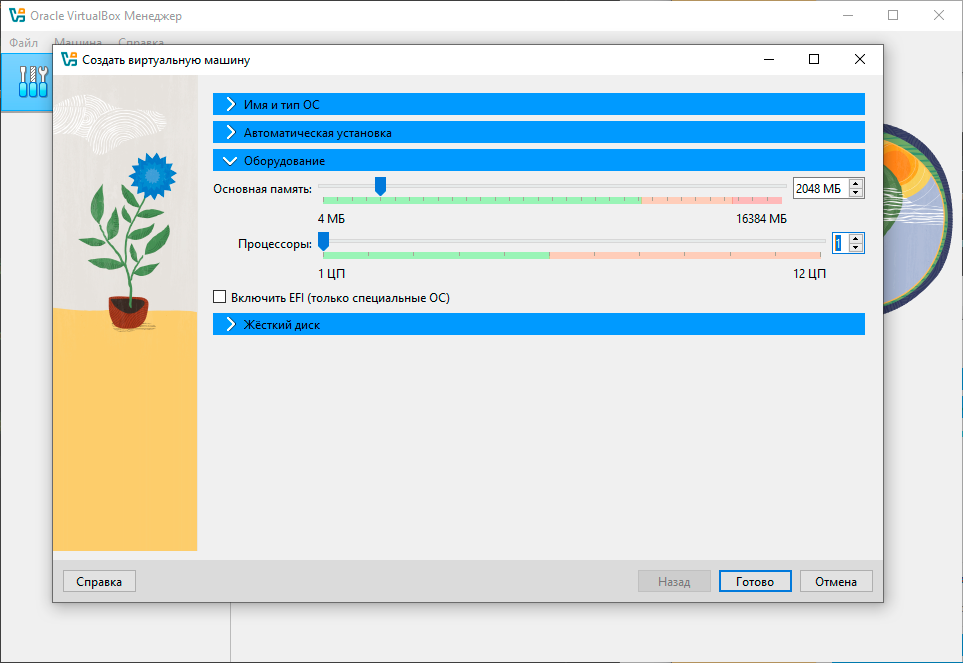
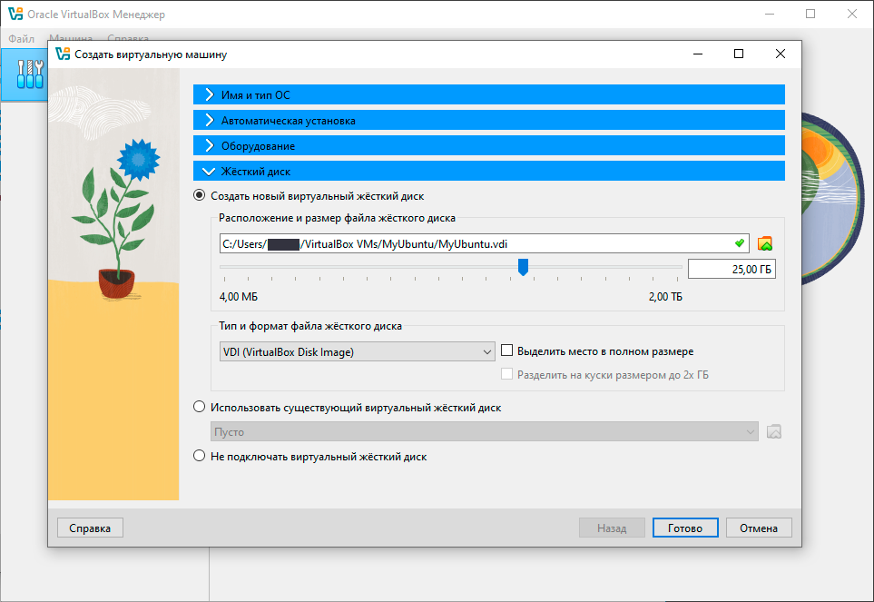

# Установите гостевой ОС

> [!NOTE]
> Документация актуальна дял версии VirtualBox 7.1.2

После [установки VirtualBox](virtualbox-installation-guide.md) нужно установить гостевую ОС. В качестве примера здесь используется Ubuntu Desktop 24.04.1 LTS.

Чтобы установить гостевую ОС, выполните действия:

1. Зайдите на сайт [ubuntu.com/download/desktop](https://ubuntu.com/download/desktop) и скачайте ISO-образ дистрибутива.

   

1. Запустите VirtualBox и нажмите кнопку *Создать*

   

1. Откроется окно создания виртуальной машины. Заполните поля:
    * Имя ОС;
    * Папка, где будет хранится гостевая ОС;
    * Образ ISO, который вы скачали на шаге 1;
    * Тип ОС (в данном случае Linux);
    * Подтип (в данном случае Ubuntu);
    * Версия (в данном случае Ubuntu 64bit);

   

   > [!NOTE]
   > Также в этом разделе предусмотрена опция *Пропустить автоматическую установку*. Если ее активировать, устанавливать гостевую ОС нужно будет вручную. Поэтому мы рекоммендуем оставить это поле пустым, чтобы установка прошла автоматически.

1. В разделе «Автоматическая установка» заполните имя пользователя, пароль, имя ПК и доменное имя. Этот шаг опциональный, вы можете использовать предзаполненные значения.

   

1. В разделе «Оборудование» укажите количество Гб оперативной памяти и количество ядер процессора, которые будут зарезервированы под вашу виртуальную машину. Эти ресурсы выделяются из оперативной памяти и процессора вашего компьютера.

   

   Для корректной работы гостевой ОС рекоммендуем выделять минимум 2Гб оперативной памяти.

1. В разделе «Жесткий диск» укажите количество Гб дискового пространства, которое будет выделено для вашей виртуальной машины. Эти ресурсы выделяются из дискового пространства вашего компьютера.

   

   Есть два способа выделения дискового пространства под виртуальную машину:

   * Статический — дисковое пространство будет выделено в полном объеме, в котором вы указали при создании;
   * Динамический — дисковое пространство выделяется постепенно, по мере заполнения.

   Статическое выделение ресурсов позвоялет работать гостевой ОС быстрее, однако дисковое пространство будет зарезервировано сразу. С другой стороны, динамическое выделение ресурсов позволяет экономить место на жестком диске вашей хостовой ОС. Оба способа равнозначны, и зависят от ваших потребностей.

   Чтобы выбрать статическое распределение ресурсов, нажмите галочку напротив поля *Выделить место в полном размере*. Для динамического распределения ресурсов оставьте поле пустым.

   Также если у вас уже есть готовый образ диска виртуальной машины, вы можете выбрать его в поле *Использовать существующий виртуальный жесткий диск*.

   Если вы не хотите выделять дисковое пространство, выберите опцию *Не подключать виртуальный жесткий диск*. В этом случае гостевая ОС будет работать внутри оперативной памяти вашего компьютера.

1. Нажмите кнопку *Готово*. Будет создана виртуальная машины и начнется установка гостевой ОС.

---

## Дальнейшие шаги

Установите дополнительный пакет VirtualBox Guest Additions (опционально).
