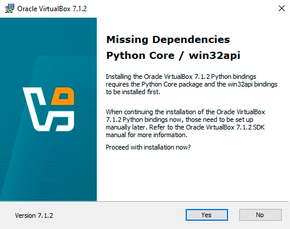

# Установка Python Core и зависимости win32api

Во время установки VirtualBox может появится такое окно:



Оно говорит о том, что на компьютере отсутствует пакет Python Core и зависимость win32api. Чтобы их установить, выполните действия:

1. Установите Python. Для этого откройте сайт python.org/downloads и нажмите кнопку *Download Python 3.13.0*.

    

   После нажатия на кнопку начнется скачивание установщика. В зависимости от релиза версия Python может отличаться.

1. Откройте файл установщика. После открытия появится приветственное окно установки Python. Отметьте галочкой оба пункта и нажмите кнопку *Install Now*.

    

1. После окончания установки вы увидите окно об успехе. Нажмите кнопку *Close*

   

1. Далее установите зависимость win32api. Для этого откройте командную строку Windows или терминал Linux и введите команду:

   ```bash
   py -m pip install pywin32
   ```

   

1. Готово.
