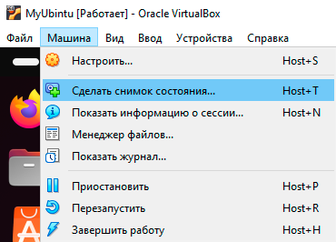
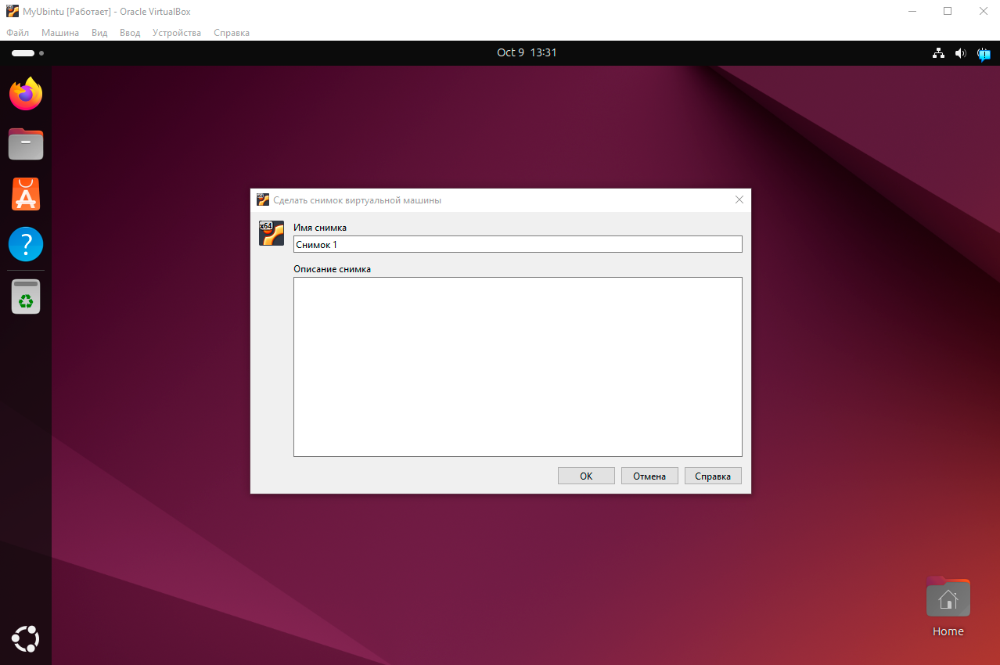
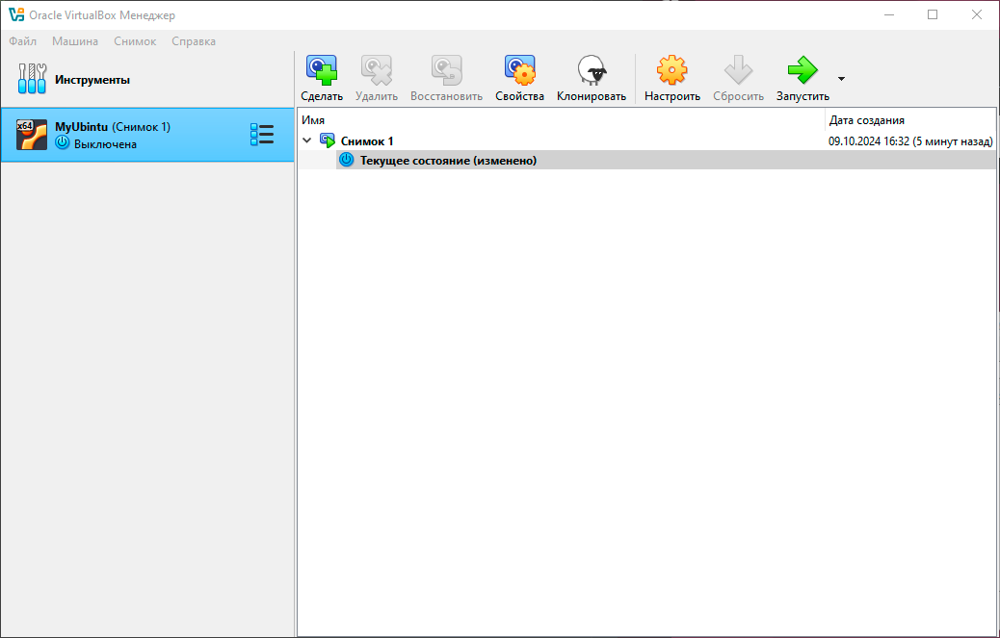

# Как создать снапшот

Snapshot (далее – «снапшот») – это снимок состояния виртуальной машины. Снапшот позвоялет зафиксировать состояние виртуальной машины, чтобы в будущем можно было вернуться к нему. Это полезный инструмент, если мы планируем совершить какие-то действия в гостевой ОС, которые могут повлиять на сохранность данных.

Чтобы сделать снапшот, выполните действия:

1. В верхнем меню VirtualBox перейдите в раздел *Машина* и выберите пункт *Сделать снимок состояния*.

   

1. Дайте название снимку состояния и нажмите *ОК*.

   

1. Готово.

В дальнейшем снапшоты можно запускать из меню VirtualBox,которое находится справа от списка виртуальных машин.

