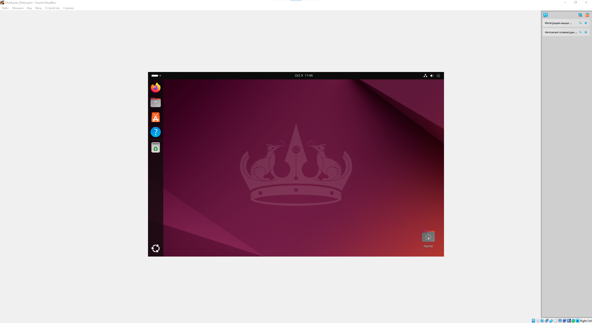
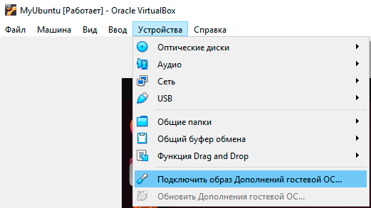
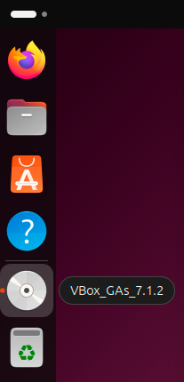
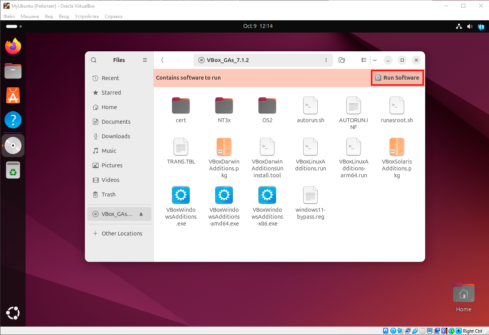
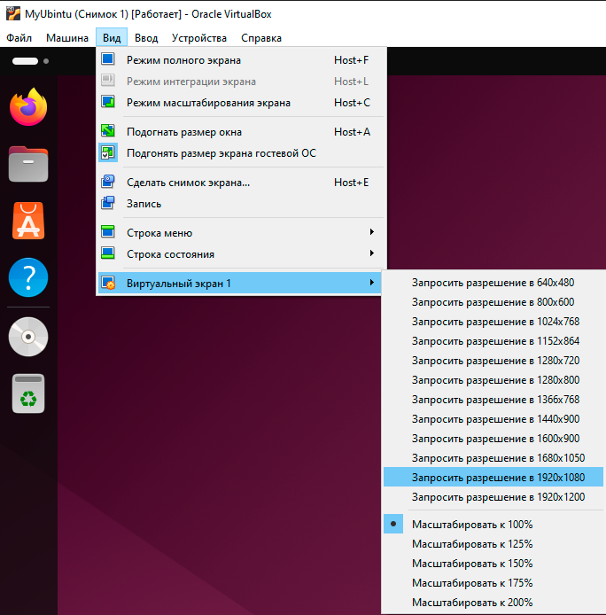

# Установка VirtualBox Guest Additions

Когда вы запускаете виртуальную машину, вы можете столкнуться с тем, что размер экрана гостевой ОС не подстраивается под размер монитора.



Чтобы это исправить, установите пакет VirtualBox Guest Additions. Рассмотрим установку дополнения на примере Ubuntu:

1. Откройте терминал Linux и выполните команды:

   ```bash
   sudo apt update
   sudo apt-get install build-essential module-assistant
   ```

1. В верхнем меню VirtualBox перейдите в раздел *Устройства* и выберите пункт *Подключите образ Дополнительной гостевой ОС*.

   

1. В боковом меню слева нажмите на появившуюся иконку с диском.

   

1. В появившимся окне нажмите *Run Software*.

   

1. Перезагрузите гостевую ОС.

Теперь вы можете отрегулировать размер окна в зависимости от типа вашего дисплея. Для этого перейдите во вкладку *Вид -> Виртуальный экран 1* и выберите нужное разрешение.


