# Установка VirtualBox

> [!NOTE]
> Документация актуальна дял версии VirtualBox 7.1.2

Чтобы установить VirtualBox, выполните действия:

1. Откройте сайт [virtualbox.org](https://www.virtualbox.org/), нажмите кнопку *Download*:

    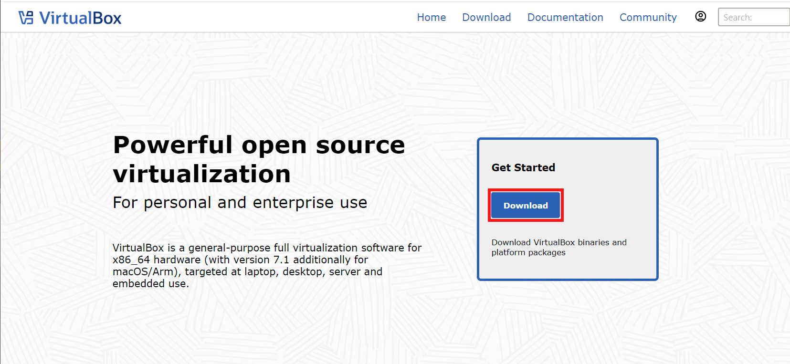

1. Выберите платформу хостовой ОС

    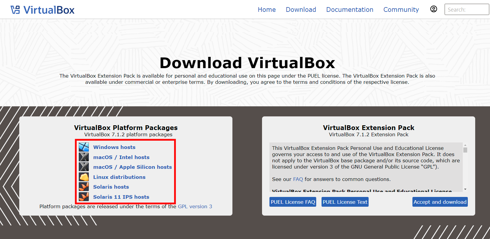

1. Нажмите на выбранную платформу. После нажатия начнется скачивание установщика.

   

1. Откройте файл установщика. После открытия появится приветственное окно установки VirtualBox. Нажмите в нем кнопку *Next*.

   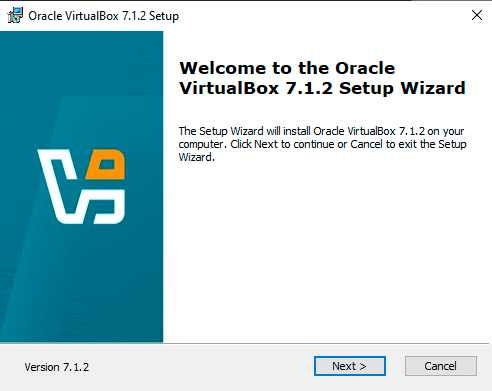

1. Ознакомьтесь с лицензионным соглашением и выберите пункт *I accept the terms in the License Agreement*. Затем нажмите кнопку *Next*.

   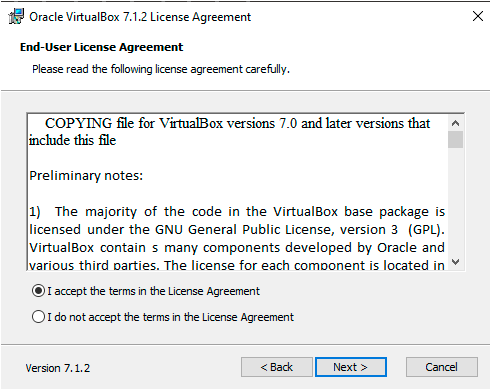

1. Далее отобразится список компонентов, которые будут установлены. Вы можете убрать какой-либо компонент, но мы рекоммендуем оставить список без изменений, иначе программа может работать некорректно.

   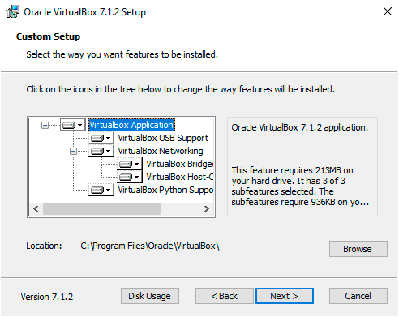

1. Выберите директорию, куда будет установлен VirtualBox, или оставьте значение по умолчанию.

   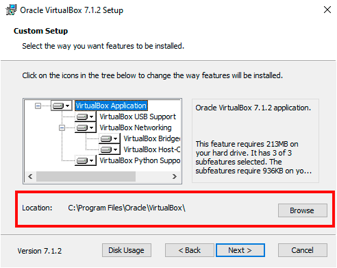

1. Если вы хотите установить VirtualBox в другую директорию, нажмите кнопку *Browse*. Далее откроется окно с выбором доступных директорий. Выберите нужную папку и нажмите кнопку *OK*.

   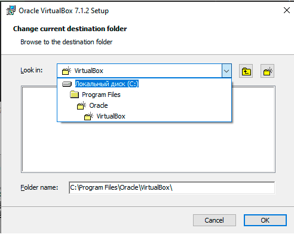

1. Далее отобразится предупреждение о том, что во время установки VirtualBox на вашем компьютере будет временно отключен доступ в интернет. После завершения установки доступ восстановится. Нажмите *Yes*, чтобы продолжить установку.

   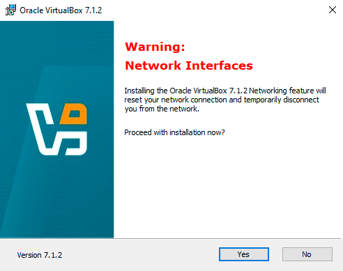

1. Если вы видите такое окно, значит на компьютере отсутсвует пакет Python Core и зависимость win32api. Чтобы установить их, воспользуйтесь [инструкцией](python-installation-guide.md).

   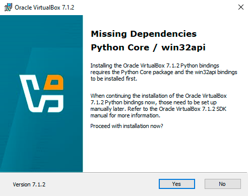

   Если окно не появилось, перейдите к следующему шагу.

1. Отметьте галочкой нужные опции или ни одной.

   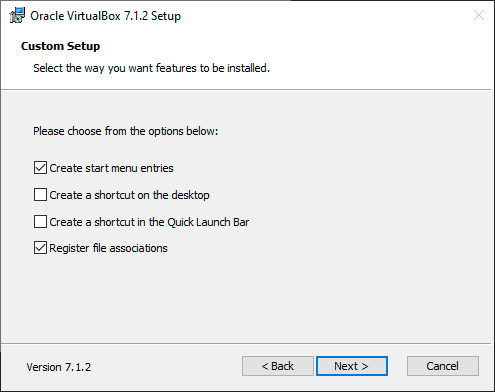

   Доступные варианты:
   * *Create start menu entries* — создать запись в меню «Пуск»;
   * *Create a shortcut on the desktop* — создать значок на рабочем столе;
   * *Create a shortcut in the Quick Launch Bar* — создать значок на Панели быстрого запуска;
   * *Register file association* — создать ассоциацию файлов. Этот пункт означает, что хостовая ОС автоматически будет определять файлы нужного формата;

1. Нажмите кнопку *Install*. После нажатия начнется процесс установки.

   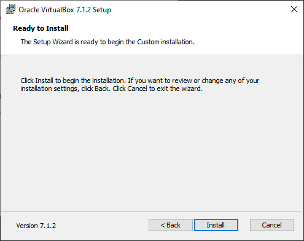

1. Установка завершена. Нажмите кнопку *Finish*.

   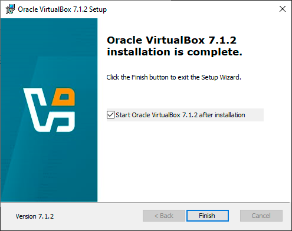

   Также вы можете отметить галочкой пункт *Start VirtualBox 7.1.2 after installation*, если хотите запустить VirtualBox сразу после завершения установки.

---

## Дальнейшие шаги

1. [Установите гостевую ОС](guest-os-installation-guide.md);
1. Установите дополнительный пакет VirtualBox Guest Additions (опционально).
